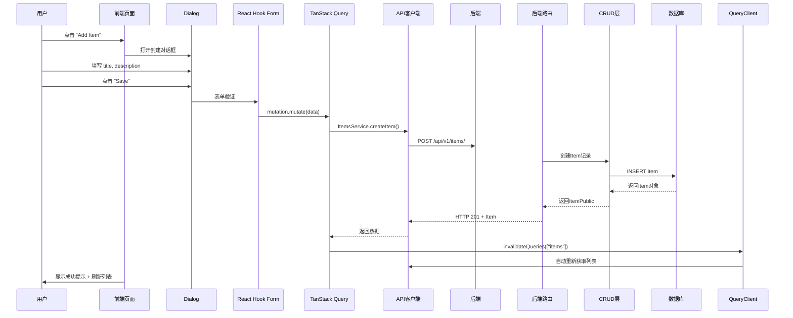

# 项目现状快照

**生成时间**：2025-12-30T00:00:00Z
**需求ID**：REQ_004_extraction_config
**项目名称**：UExtract - 信息抽取平台

---

## 1. 技术栈概览

### 后端
- **框架**：FastAPI (0.114.2+)
- **语言版本**：Python 3.10+
- **数据库**：PostgreSQL (psycopg 3.1.13+)
- **ORM**：SQLModel (基于 Pydantic + SQLAlchemy)
- **异步支持**：同步模式
- **数据验证**：Pydantic v2
- **认证**：JWT + Bcrypt

### 前端
- **框架**：React 19.1.1
- **语言**：TypeScript 5.9.3
- **UI库**：Chakra UI v3.30.0
- **状态管理**：@tanstack/react-query v5.90.7
- **路由**：@tanstack/react-router v1.131.50
- **构建工具**：Vite 7.2.2
- **API客户端**：axios 1.12.2 (通过 OpenAPI 自动生成)

---

## 2. 后端目录结构

```
backend/
├── app/
│   ├── alembic/              # 数据库迁移
│   │   └── versions/         # 迁移脚本
│   ├── api/
│   │   ├── deps.py           # 依赖注入 (认证、数据库Session)
│   │   ├── main.py           # API路由汇总
│   │   └── routes/           # 路由层
│   │       ├── users.py      # 用户管理 CRUD
│   │       ├── items.py      # 项目管理 CRUD
│   │       ├── login.py      # 登录认证
│   │       ├── private.py    # 私有接口
│   │       └── utils.py      # 工具接口
│   ├── core/
│   │   ├── config.py         # 配置管理 (Pydantic Settings)
│   │   ├── db.py             # 数据库Session
│   │   ├── security.py       # 安全相关 (JWT、密码哈希)
│   │   └── extraction/       # 信息抽取模块 (已创建目录)
│   ├── crud.py               # CRUD 操作层
│   ├── models.py             # 数据模型 (SQLModel)
│   ├── schemas/              # [待确认]
│   ├── services/             # [待确认]
│   └── utils.py              # 工具函数
```

| 目录 | 作用 | 典型文件 |
|------|------|----------|
| `api/routes/` | API路由定义和请求处理 | users.py, items.py |
| `core/` | 核心基础设施 | config.py, db.py, security.py |
| `crud.py` | 数据库CRUD操作封装 | create_user, get_user_by_email |
| `models.py` | SQLModel数据模型定义 | User, Item |
| `alembic/versions/` | 数据库迁移脚本 | *.py 迁移文件 |

---

## 3. 前端目录结构

```
frontend/src/
├── client/                    # OpenAPI 自动生成的 API 客户端
│   ├── core/
│   │   ├── ApiError.ts
│   │   ├── OpenAPI.ts
│   │   └── request.ts
│   ├── schemas.gen.ts        # API Schema 类型定义
│   ├── sdk.gen.ts            # API 调用函数
│   └── types.gen.ts          # 通用类型
├── components/
│   ├── Admin/                # 管理员相关组件
│   ├── Common/               # 通用组件 (Navbar, Sidebar)
│   ├── Items/                # Items CRUD 组件
│   ├── UserSettings/         # 用户设置组件
│   ├── ui/                   # UI基础组件封装
│   ├── ExtractionFields/     # [新增目录,待开发]
│   ├── ExtractionLists/      # [新增目录,待开发]
│   ├── ExtractionTemplates/  # [新增目录,待开发]
│   └── ExtractionExtract/    # [新增目录,待开发]
├── routes/                    # 路由页面组件
│   ├── _layout/
│   │   ├── admin.tsx         # 管理员页面
│   │   ├── items.tsx         # Items 管理页面
│   │   └── settings.tsx      # 设置页面
│   └── login.tsx             # 登录页面
├── hooks/
│   ├── useAuth.ts            # 认证钩子
│   └── useCustomToast.ts     # 通知钩子
└── main.tsx                  # 应用入口
```

| 目录 | 作用 | 典型文件 |
|------|------|----------|
| `client/` | OpenAPI生成的类型安全的API客户端 | sdk.gen.ts |
| `components/Common/` | 通用UI组件 | Navbar.tsx, Sidebar.tsx |
| `components/Items/` | Items业务组件 | AddItem.tsx, DeleteItem.tsx |
| `components/ui/` | UI基础组件封装 | button.tsx, dialog.tsx |
| `routes/` | 页面路由组件 | items.tsx, admin.tsx |
| `hooks/` | 自定义React Hooks | useAuth.ts |

---

## 4. 典型业务流程

### 示例：Items管理完整CRUD流程



**关键代码位置**：

| 环节 | 位置 |
|------|------|
| 前端页面 | [frontend/src/routes/_layout/items.tsx](frontend/src/routes/_layout/items.tsx) |
| 创建对话框 | [frontend/src/components/Items/AddItem.tsx](frontend/src/components/Items/AddItem.tsx) |
| API调用 | [frontend/src/client/sdk.gen.ts](frontend/src/client/sdk.gen.ts) (自动生成) |
| 后端路由 | [backend/app/api/routes/items.py](backend/app/api/routes/items.py:57) |
| 数据模型 | [backend/app/models.py](backend/app/models.py:76) |
| CRUD操作 | [backend/app/crud.py](backend/app/crud.py:49) |

---

## 5. 通用能力

| 能力 | 是否支持 | 实现位置 |
|------|----------|----------|
| 认证授权 (JWT) | ✅ | [backend/app/core/security.py](backend/app/core/security.py) |
| 用户权限控制 | ✅ | [backend/app/api/deps.py](backend/app/api/deps.py) - CurrentUser, get_current_active_superuser |
| 错误处理 | ✅ | FastAPI HTTPException + 前端 handleError |
| 数据验证 | ✅ | Pydantic v2 (后端) + React Hook Form (前端) |
| 分页封装 | ✅ | [backend/app/api/routes/items.py:37](backend/app/api/routes/items.py:37) - skip/limit 参数 |
| CRUD封装 | ✅ | [backend/app/crud.py](backend/app/crud.py) - 通用CRUD函数 |
| OpenAPI自动生成 | ✅ | FastAPI自动生成 + @hey-api/openapi-ts |
| 状态管理 | ✅ | @tanstack/react-query (服务端状态) |
| 文件上传 | ⚠️ | [待确认] - 需求中提到需要此功能 |
| 邮件发送 | ✅ | [backend/app/utils.py](backend/app/utils.py) + SMTP配置 |

---

## 6. 构建与部署

### 本地开发

**后端启动**：
```bash
cd backend
uv run uvicorn app.main:app --reload --port 8000
```

**前端启动**：
```bash
cd frontend
npm run dev  # http://localhost:5173
```

### Docker部署

```bash
docker-compose up -d
```

**环境变量配置**：
- 后端：通过项目根目录 `.env` 文件
- 前端：环境变量通过 Vite 注入

### 代码生成

```bash
# 生成前端API客户端
npm run generate-client
```

---

## 7. 数据库模式

**现有表**：
- `user` - 用户表 (id, email, hashed_password, full_name, is_active, is_superuser)
- `item` - 项目表 (id, title, description, owner_id)

**关系**：
- User ← Item (一对多，级联删除)

---

## 8. 技术债务与注意事项

- [ ] `backend/app/schemas/` 目录存在但未在代码中使用，可能为空或已废弃
- [ ] `backend/app/services/` 目录存在但未在代码中使用，可能为空或已废弃
- [ ] `backend/app/core/extraction/` 目录已创建但为空，为本需求预留
- [ ] 前端已创建 `ExtractionFields/`, `ExtractionLists/`, `ExtractionTemplates/`, `ExtractionExtract/` 目录但为空
- [ ] 文件上传功能需要实现
- [ ] Markitdown 包集成需要实现 (用于文档转文本)

---

## 9. 开发规范

### 后端代码风格
- **格式化工具**：Ruff
- **类型检查**：Mypy (strict模式)
- **测试框架**：Pytest
- **数据库迁移**：Alembic

### 前端代码风格
- **格式化工具**：Biome
- **类型检查**：TypeScript
- **测试框架**：Playwright
- **组件库**：Chakra UI v3

### Git提交规范
- 使用 Conventional Commits 格式
- 提交前必须通过 pre-commit hooks 检查

---

## 10. 可复用资产

### 后端可复用
- `crud.py` 中的通用CRUD模式
- `api/deps.py` 中的依赖注入模式 (CurrentUser, SessionDep)
- `api/routes/items.py` 中的分页查询模式
- `core/security.py` 中的JWT和密码处理
- `models.py` 中的SQLModel定义模式

### 前端可复用
- `components/ui/` 中的UI基础组件
- `components/Items/` 中的CRUD组件模式
- `hooks/useCustomToast.ts` 中的通知处理
- `routes/_layout/items.tsx` 中的列表页面模式
- OpenAPI自动生成的类型安全API客户端

---

**快照生成完成** ✅
