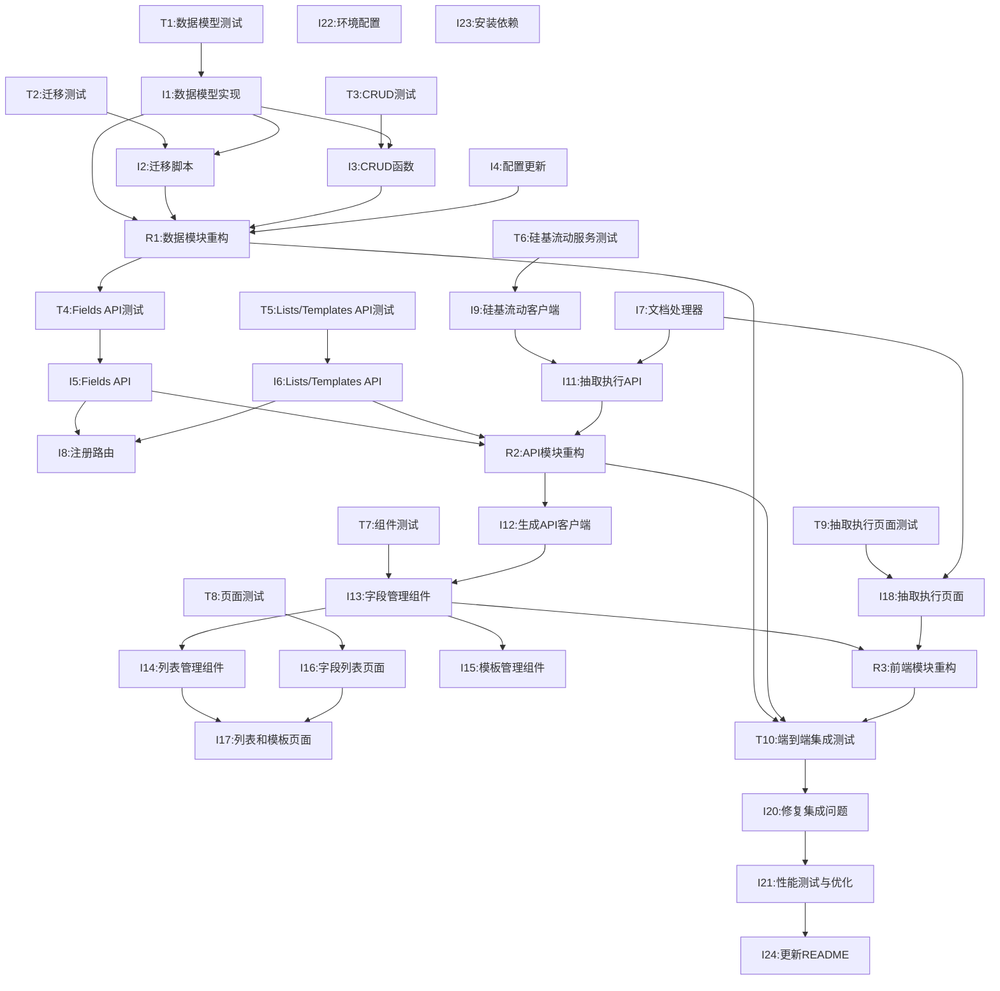

# TDD模块化开发任务清单

**需求ID**：REQ_004_extraction_config
**需求名称**：信息抽取配置功能
**开发模式**：测试驱动开发(TDD) + 模块化渐进式开发
**创建时间**：2025-12-30T03:00:00Z
**预计工期**：5天

---

## 技术栈参考文档

在开始开发相关任务前,请先阅读以下技术资料:

### 1. Markitdown 文档处理
- **文档路径**: `tasks/技术选型-文件处理技术说明.md`
- **关键内容**:
  - Python库,用于将各种文件格式转换为Markdown
  - 支持格式: PDF, PowerPoint, Word, Excel, Images (OCR), Audio, HTML等
  - 基本用法:
    ```python
    from markitdown import MarkItDown
    md = MarkItDown()
    result = md.convert("test.xlsx")
    print(result.text_content)
    ```
  - 安装命令: `pip install 'markitdown[all]'` 或 `uv add markitdown`
- **相关任务**:
  - [P0-I10] 创建文档处理器
  - [P2-I23] 安装Python依赖

### 2. 硅基流动AI大模型接口
- **文档路径**: `tasks/技术选型-ai大模型接口说明.md`
- **关键内容**:
  - API端点: `https://api.siliconflow.cn/v1/chat/completions`
  - 认证方式: `Authorization: Bearer <API_KEY>`
  - 推荐模型:
    - `deepseek-ai/DeepSeek-R1`: 中文强、推理快
    - `Qwen/Qwen2-7B-Instruct`: 阿里开源、免费可用
  - Python调用示例:
    ```python
    import requests
    url = "https://api.siliconflow.cn/v1/chat/completions"
    headers = {
        "Authorization": f"Bearer {API_KEY}",
        "Content-Type": "application/json"
    }
    payload = {
        "model": "deepseek-ai/DeepSeek-R1",
        "messages": [{"role": "user", "content": "你的问题"}],
        "temperature": 0.7
    }
    response = requests.post(url, json=payload, headers=headers)
    ```
- **相关任务**:
  - [P0-I4] 更新配置文件 (添加API_KEY和MODEL配置)
  - [P0-I9] 创建硅基流动客户端
  - [P0-I11] 创建抽取执行API

---

## 模块价值排序

| 模块 | 业务价值 | 技术复杂度 | 开发优先级 | 预计工时 |
|------|----------|------------|------------|----------|
| 核心数据模块 | 高 | 中 | P0 | 8小时 |
| API服务模块 | 高 | 中 | P0 | 10小时 |
| 前端展示模块 | 中 | 低 | P1 | 12小时 |
| 集成测试模块 | 中 | 低 | P1 | 4小时 |
| 文档部署模块 | 低 | 低 | P2 | 2小时 |

**总计**：约36小时（5个工作日）

---

## 模块一：核心数据模块 (TDD循环)

**模块目标**：建立稳定的数据层基础，支持抽取字段、列表、模板的数据存储

### 🔴 Red阶段：编写失败测试

- [ ] **[P0-T1]** 编写数据模型测试 `backend/tests/test_extraction_models.py`
  - 依赖：无
  - TDD步骤：Red阶段
  - 内容：
    - 测试 `ExtractionField` 模型字段验证
    - 测试 `ExtractionList` 模型关系
    - 测试 `ExtractionTemplate` 模型关系
    - 测试用户级隔离 (`owner_id` 过滤)
  - 验收：测试运行失败（因为模型不存在）
  - 预计：1.5小时

- [ ] **[P0-T2]** 编写数据库迁移测试 `backend/tests/test_extraction_migrations.py`
  - 依赖：模型测试
  - TDD步骤：Red阶段
  - 内容：
    - 测试迁移脚本的正向执行
    - 测试迁移脚本的回滚操作
    - 测试索引和约束创建
  - 验收：测试运行失败（因为迁移脚本不存在）
  - 预计：1小时

- [ ] **[P0-T3]** 编写CRUD函数测试 `backend/tests/test_crud_extraction.py`
  - 依赖：模型测试
  - TDD步骤：Red阶段
  - 内容：
    - 测试 `create_extraction_field` 函数
    - 测试 `get_extraction_fields` 分页查询
    - 测试 `update_extraction_field` 函数
    - 测试 `delete_extraction_field` 函数
    - 测试用户数据隔离
  - 验收：测试运行失败（因为CRUD函数不存在）
  - 预计：1.5小时

### 🟢 Green阶段：实现最小功能

- [x] **[P0-I1]** 创建数据模型 `backend/app/models.py` (追加)
  - 依赖：数据模型测试
  - TDD步骤：Green阶段
  - 内容：
    - 实现 `ExtractionFieldBase`, `ExtractionField`, `ExtractionFieldPublic`
    - 实现 `ExtractionListBase`, `ExtractionList`, `ExtractionListPublic`
    - 实现 `ExtractionTemplateBase`, `ExtractionTemplate`, `ExtractionTemplatePublic`
    - 实现 `ExtractionFieldsPublic`, `ExtractionListsPublic`, `ExtractionTemplatesPublic`
  - 验收：所有模型测试通过，类型检查通过
  - 预计：1.5小时
  - 可复用：参考 `backend/app/models.py:43` 的 `User` 模式

- [x] **[P0-I2]** 编写数据库迁移脚本
  - 命令：`uv run alembic revision --autogenerate -m "Add extraction models"`
  - 依赖：数据模型 + 迁移测试
  - TDD步骤：Green阶段
  - 内容：
    - 生成迁移脚本 `backend/app/alembic/versions/xxx_add_extraction_models.py`
    - 调整迁移脚本（如需要）
    - 执行迁移：`uv run alembic upgrade head`
  - 验收：迁移测试通过，数据库表创建成功
  - 预计：1小时

- [ ] **[P0-I3]** 创建CRUD函数 `backend/app/crud.py` (追加)
  - 依赖：数据模型 + CRUD测试
  - TDD步骤：Green阶段
  - 内容：
    - 实现 `create_extraction_field(session, field_create, owner_id)`
    - 实现 `get_extraction_fields(session, owner_id, skip, limit)`
    - 实现 `get_extraction_field_by_id(session, field_id, owner_id)`
    - 实现 `update_extraction_field(session, db_field, field_in)`
    - 实现 `delete_extraction_field(session, db_field)`
    - 同样实现 List 和 Template 的CRUD函数
  - 验收：所有CRUD测试通过
  - 预计：2小时
  - 可复用：参考 `backend/app/crud.py:10` 的 `create_user` 模式

- [ ] **[P0-I4]** 更新配置文件 `backend/app/core/config.py` (追加)
  - 依赖：无
  - TDD步骤：Green阶段
  - 内容：
    - 添加 `SILICONFLOW_API_KEY: str = ""`
    - 添加 `SILICONFLOW_MODEL: str = "deepseek-ai/DeepSeek-R1"`
    - 添加 `MAX_UPLOAD_SIZE: int = 10 * 1024 * 1024`
    - 添加 `ALLOWED_FILE_TYPES: list[str]`
  - 验收：配置验证通过
  - 预计：0.5小时

### 🔵 Refactor阶段：优化重构

- [ ] **[P0-R1]** 数据模块集成测试与重构
  - 依赖：所有Green阶段任务
  - TDD步骤：Refactor阶段
  - 内容：
    - 运行完整数据模块测试套件
    - 检查测试覆盖率（目标>90%）
    - 重构代码结构，消除重复
    - 优化数据库查询性能
  - 验收：
    - 所有测试通过
    - 测试覆盖率>90%
    - 代码质量检查通过（ruff, mypy）
  - 预计：1小时

**模块完成标准**：
- ✅ 所有数据层测试通过（覆盖率>90%）
- ✅ 数据模型可独立使用
- ✅ 迁移脚本可独立执行和回滚
- ✅ CRUD函数可独立调用
- ✅ 用户数据隔离正确实现

---

## 模块二：API服务模块 (TDD循环)

**模块目标**：基于数据模块构建RESTful API服务层

### 🔴 Red阶段：编写失败测试

- [ ] **[P0-T4]** 编写API路由测试 `backend/tests/test_api_extraction_fields.py`
  - 依赖：核心数据模块完成
  - TDD步骤：Red阶段
  - 内容：
    - 测试 `GET /api/v1/extraction/fields/` 列表接口
    - 测试 `POST /api/v1/extraction/fields/` 创建接口
    - 测试 `GET /api/v1/extraction/fields/{id}` 详情接口
    - 测试 `PUT /api/v1/extraction/fields/{id}` 更新接口
    - 测试 `DELETE /api/v1/extraction/fields/{id}` 删除接口
    - 测试用户数据隔离
    - 测试分页功能
  - 验收：测试运行失败（因为API不存在）
  - 预计：2小时

- [ ] **[P0-T5]** 编写List和Template API测试
  - 依赖：Fields API测试
  - TDD步骤：Red阶段
  - 内容：同上，针对List和Template的API测试
  - 验收：测试运行失败
  - 预计：1.5小时

- [ ] **[P0-T6]** 编写硅基流动服务测试 `backend/tests/test_siliconflow_service.py`
  - 依赖：无
  - TDD步骤：Red阶段
  - 内容：
    - 测试API调用成功场景
    - 测试API调用失败场景
    - 测试重试机制
  - 验收：测试运行失败（因为服务不存在）
  - 预计：1小时

### 🟢 Green阶段：实现最小功能

- [ ] **[P0-I5]** 创建Fields API路由 `backend/app/api/routes/extraction_fields.py`
  - 依赖：Fields API测试
  - TDD步骤：Green阶段
  - 内容：
    - 实现 `router = APIRouter(prefix="/extraction/fields", tags=["extraction-fields"])`
    - 实现 `GET /` - 列表接口（参考 `items.py:13`）
    - 实现 `POST /` - 创建接口（参考 `items.py:57`）
    - 实现 `GET /{id}` - 详情接口（参考 `items.py:44`）
    - 实现 `PUT /{id}` - 更新接口（参考 `items.py:71`）
    - 实现 `DELETE /{id}` - 删除接口（参考 `items.py:95`）
    - 所有接口添加 `owner_id` 过滤，实现用户数据隔离
  - 验收：Fields API测试通过
  - 预计：2.5小时
  - 可复用：完全参考 `backend/app/api/routes/items.py`

- [ ] **[P0-I6]** 创建Lists API路由 `backend/app/api/routes/extraction_lists.py`
  - 依赖：Lists API测试
  - TDD步骤：Green阶段
  - 内容：同Fields API结构
  - 验收：Lists API测试通过
  - 预计：1.5小时

- [ ] **[P0-I7]** 创建Templates API路由 `backend/app/api/routes/extraction_templates.py`
  - 依赖：Templates API测试
  - TDD步骤：Green阶段
  - 内容：同Fields API结构
  - 验收：Templates API测试通过
  - 预计：1.5小时

- [ ] **[P0-I8]** 注册新路由 `backend/app/api/main.py` (修改)
  - 依赖：所有API路由
  - TDD步骤：Green阶段
  - 内容：
    - 添加 `from app.api.routes import extraction_fields, extraction_lists, extraction_templates`
    - 添加 `api_router.include_router(extraction_fields.router)`
    - 添加 `api_router.include_router(extraction_lists.router)`
    - 添加 `api_router.include_router(extraction_templates.router)`
  - 验收：路由可访问
  - 预计：0.5小时

- [ ] **[P0-I9]** 创建硅基流动客户端 `backend/app/core/extraction/siliconflow_client.py`
  - 依赖：硅基流动服务测试
  - TDD步骤：Green阶段
  - **前置任务**: 先阅读 `tasks/技术选型-ai大模型接口说明.md`
  - 内容：
    - 实现 `SiliconFlowClient` 类
    - 实现 `extract(text, template)` 方法
    - 实现重试机制（最多3次）
    - 实现超时控制（60秒）
  - 验收：硅基流动服务测试通过
  - 预计：2小时
  - 参考: `tasks/技术选型-ai大模型接口说明.md`

- [ ] **[P0-I10]** 创建文档处理器 `backend/app/core/extraction/document_processor.py`
  - 依赖：无
  - TDD步骤：Green阶段
  - **前置任务**: 先阅读 `tasks/技术选型-文件处理技术说明.md`
  - 内容：
    - 安装 `markitdown` 包
    - 实现 `convert_document_to_text(file_path, file_type)` 函数
    - 支持图片、PDF、DOCX、XLSX、TXT格式
  - 验收：文档转换功能正常
  - 预计：1.5小时
  - 参考: `tasks/技术选型-文件处理技术说明.md`

- [ ] **[P0-I11]** 创建抽取执行API `backend/app/api/routes/extraction.py`
  - 依赖：硅基流动客户端 + 文档处理器
  - TDD步骤：Green阶段
  - 内容：
    - 实现 `POST /api/v1/extraction/extract/` 接口
    - 实现文件上传处理（`UploadFile`）
    - 实现文件大小验证（10MB限制）
    - 实现文件类型验证
    - 实现抽取逻辑编排
  - 验收：抽取API测试通过
  - 预计：2.5小时

### 🔵 Refactor阶段：优化重构

- [ ] **[P0-R2]** API模块集成测试与重构
  - 依赖：所有Green阶段任务
  - TDD步骤：Refactor阶段
  - 内容：
    - 运行完整API测试套件
    - 检查测试覆盖率（目标>85%）
    - 使用Swagger测试所有API端点
    - 重构API响应格式，确保一致性
    - 优化API性能（如需要）
  - 验收：
    - 所有API测试通过
    - 测试覆盖率>85%
    - Swagger文档完整
    - API响应时间<500ms（除抽取接口）
  - 预计：1.5小时

**模块完成标准**：
- ✅ 所有API测试通过（覆盖率>85%）
- ✅ 所有API可通过Swagger访问和测试
- ✅ 用户数据隔离正确实现
- ✅ 文件上传功能正常
- ✅ 硅基流动API集成正常
- ✅ 模块可独立部署验证

---

## 模块三：前端展示模块 (TDD循环)

**模块目标**：构建用户界面，与后端API对接

### 🔴 Red阶段：编写失败测试

- [ ] **[P1-T7]** 编写字段管理组件测试 `frontend/src/components/ExtractionFields/__tests__/AddExtractionField.test.tsx`
  - 依赖：API服务模块完成
  - TDD步骤：Red阶段
  - 内容：
    - 测试组件渲染
    - 测试表单验证
    - 测试提交成功场景
    - 测试提交失败场景
  - 验收：测试运行失败（因为组件不存在）
  - 预计：1.5小时

- [ ] **[P1-T8]** 编写字段列表页面测试 `frontend/src/routes/_layout/__tests__/extraction-fields.test.tsx`
  - 依赖：组件测试
  - TDD步骤：Red阶段
  - 内容：
    - 测试页面渲染
    - 测试分页功能
    - 测试数据加载
    - 测试用户交互
  - 验收：测试运行失败
  - 预计：1.5小时

- [ ] **[P1-T9]** 编写抽取执行页面测试
  - 依赖：无
  - TDD步骤：Red阶段
  - 内容：
    - 测试文件上传组件
    - 测试模板选择
    - 测试抽取执行
    - 测试结果展示
  - 验收：测试运行失败
  - 预计：1.5小时

### 🟢 Green阶段：实现最小功能

- [ ] **[P1-I12]** 重新生成前端API客户端
  - 命令：`npm run generate-client`
  - 依赖：后端API服务模块完成
  - TDD步骤：Green阶段
  - 内容：
    - 启动后端服务
    - 运行OpenAPI生成命令
    - 验证生成的类型定义
  - 验收：API客户端生成成功，类型定义完整
  - 预计：0.5小时

- [ ] **[P1-I13]** 创建字段管理组件 `frontend/src/components/ExtractionFields/`
  - 依赖：API客户端 + 组件测试
  - TDD步骤：Green阶段
  - 内容：
    - `AddExtractionField.tsx` - 创建字段对话框（参考 `AddItem.tsx`）
    - `EditExtractionField.tsx` - 编辑字段对话框（参考 `EditItem.tsx`）
    - `DeleteExtractionField.tsx` - 删除字段确认（参考 `DeleteItem.tsx`）
    - 使用React Hook Form进行表单验证
    - 使用TanStack Query进行数据操作
  - 验收：字段管理组件测试通过
  - 预计：3小时
  - 可复用：完全参考 `frontend/src/components/Items/` 模式

- [ ] **[P1-I14]** 创建列表管理组件 `frontend/src/components/ExtractionLists/`
  - 依赖：字段管理组件
  - TDD步骤：Green阶段
  - 内容：同字段管理组件结构
  - 验收：列表管理组件正常
  - 预计：2小时

- [ ] **[P1-I15]** 创建模板管理组件 `frontend/src/components/ExtractionTemplates/`
  - 依赖：列表管理组件
  - TDD步骤：Green阶段
  - 内容：同字段管理组件结构
  - 验收：模板管理组件正常
  - 预计：2小时

- [ ] **[P1-I16]** 创建字段列表页面 `frontend/src/routes/_layout/extraction-fields.tsx`
  - 依赖：字段管理组件 + 页面测试
  - TDD步骤：Green阶段
  - 内容：
    - 集成 `AddExtractionField` 组件
    - 实现表格展示（参考 `items.tsx`）
    - 实现分页功能
    - 实现编辑和删除操作
  - 验收：字段列表页面测试通过
  - 预计：1.5小时
  - 可复用：完全参考 `frontend/src/routes/_layout/items.tsx`

- [ ] **[P1-I17]** 创建列表和模板页面
  - 依赖：字段列表页面
  - TDD步骤：Green阶段
  - 内容：同字段列表页面结构
  - 验收：页面正常访问
  - 预计：2小时

- [ ] **[P1-I18]** 创建抽取执行页面 `frontend/src/routes/_layout/extraction-extract.tsx`
  - 依赖：抽取执行页面测试
  - TDD步骤：Green阶段
  - 内容：
    - 文件上传组件（拖拽 + 点击上传）
    - 模板选择下拉框
    - 开始识别按钮
    - 抽取结果展示区域
    - 清空识别结果按钮
    - 实现完整的抽取流程
  - 验收：抽取执行页面测试通过
  - 预计：3小时

- [ ] **[P1-I19]** 更新导航配置
  - 依赖：所有页面组件
  - TDD步骤：Green阶段
  - 内容：
    - 更新 `frontend/src/components/Common/SidebarItems.tsx` 添加导航项
    - 更新 `frontend/src/routes/_layout.tsx` 添加路由配置
  - 验收：导航和路由正常
  - 预计：0.5小时

### 🔵 Refactor阶段：优化重构

- [ ] **[P1-R3]** 前端模块集成测试与重构
  - 依赖：所有Green阶段任务
  - TDD步骤：Refactor阶段
  - 内容：
    - 运行完整前端测试套件
    - 检查测试覆盖率（目标>80%）
    - 端到端测试（Playwright）
    - UI/UX优化
    - 性能优化（如需要）
  - 验收：
    - 所有前端测试通过
    - 测试覆盖率>80%
    - 端到端测试通过
    - 用户体验良好
  - 预计：2小时

**模块完成标准**：
- ✅ 所有前端测试通过（覆盖率>80%）
- ✅ 所有UI组件可独立使用
- ✅ 与后端API正常对接
- ✅ 文件上传功能正常
- ✅ 抽取执行流程完整
- ✅ 模块可独立部署验证

---

## 模块四：集成测试模块

**模块目标**：确保所有模块协同工作正常

- [ ] **[P1-T10]** 端到端集成测试
  - 依赖：前三个模块完成
  - 内容：
    - 完整业务流程测试：
      1. 创建抽取字段
      2. 创建抽取列表（选择字段）
      3. 创建抽取模板（选择字段和列表）
      4. 上传文件执行抽取
      5. 查看抽取结果
    - 测试用户数据隔离
    - 测试错误处理
    - 测试边界条件
  - 验收：所有核心用户场景通过
  - 预计：2小时

- [ ] **[P1-I20]** 修复集成问题
  - 依赖：集成测试
  - 内容：
    - 修复模块间对接问题
    - 优化数据传递
    - 完善错误处理
  - 验收：所有集成测试通过
  - 预计：2小时

- [ ] **[P1-I21]** 性能测试与优化
  - 依赖：集成测试通过
  - 内容：
    - 测试API响应时间
    - 测试文件上传性能
    - 测试抽取接口性能
    - 优化性能瓶颈
  - 验收：性能指标达标
  - 预计：1小时

**模块完成标准**：
- ✅ 端到端测试通过
- ✅ 核心用户场景全部验证
- ✅ 性能指标达标
- ✅ 无阻塞性Bug

---

## 模块五：文档部署模块

**模块目标**：完善文档和部署配置

- [ ] **[P2-I22]** 更新环境变量配置
  - 依赖：无
  - 内容：
    - 更新 `.env` 文件添加硅基流动配置
    - 更新 `.env.example` 文件
  - 验收：配置正确完整
  - 预计：0.5小时

- [ ] **[P2-I23]** 安装Python依赖
  - 依赖：无
  - **前置任务**: 先阅读 `tasks/技术选型-文件处理技术说明.md`
  - 内容：
    - `uv add markitdown`
  - 验收：依赖安装成功
  - 预计：0.5小时
  - 参考: `tasks/技术选型-文件处理技术说明.md`

- [ ] **[P2-I24]** 更新README文档
  - 依赖：集成测试模块
  - 内容：
    - 添加新功能使用说明
    - 添加环境配置说明
    - 添加API使用示例
  - 验收：文档清晰易懂
  - 预计：1小时

**模块完成标准**：
- ✅ 环境配置正确
- ✅ 文档完整准确
- ✅ 用户可按文档独立部署使用

---

## TDD模块化依赖图



**图例说明**：
- 🔴 红色(T)：测试任务（Red阶段）
- 🟢 绿色(I)：实现任务（Green阶段）
- 🔵 蓝色(R)：重构任务（Refactor阶段）

---

## TDD模块化里程碑

| 里程碑 | 完成标准 | TDD状态 | 预计时间 |
|--------|----------|---------|----------|
| M1: 核心数据模块 | 所有数据层测试通过，模块可独立部署 | Red→Green→Refactor完成 | Day 1 (8小时) |
| M2: API服务模块 | 所有API测试通过，服务可独立使用 | Red→Green→Refactor完成 | Day 2 (10小时) |
| M3: 前端展示模块 | 所有前端测试通过，UI功能完整 | Red→Green→Refactor完成 | Day 3-4 (12小时) |
| M4: 集成测试模块 | 端到端测试通过，系统稳定运行 | 集成验证完成 | Day 4 (4小时) |
| M5: 文档部署模块 | 文档完整，部署配置正确 | 交付准备完成 | Day 5 (2小时) |

---

## TDD风险与应对

| 风险类型 | 具体风险 | 影响 | TDD应对措施 |
|----------|----------|------|-------------|
| 测试设计 | 测试用例覆盖不全 | 质量风险 | 每个模块完成后进行测试覆盖率检查(>85%) |
| 实现偏差 | 实现与测试预期不符 | 返工 | 严格遵循Red→Green→Refactor循环 |
| 模块耦合 | 模块间依赖过强 | 维护困难 | 每个模块完成后进行独立部署验证 |
| 性能问题 | TDD可能忽略性能 | 用户体验 | 在Refactor阶段专门进行性能优化 |
| 进度延期 | 测试编写耗时超预期 | 项目延期 | 预留20%缓冲时间，优先保证P0功能 |

---

## TDD执行注意事项

### 测试驱动原则
1. **Red阶段**：先写失败的测试，明确功能预期
2. **Green阶段**：编写最小可用代码，使测试通过
3. **Refactor阶段**：在测试保护下重构优化代码
4. **绝不跳过**：严禁跳过任何TDD阶段

### 模块化原则
1. **独立开发**：每个模块可以独立开发和测试
2. **独立部署**：每个模块完成后立即可部署验证
3. **最小依赖**：模块间依赖关系最小化
4. **渐进交付**：按业务价值优先级逐步交付

### 质量保证
1. **测试覆盖率**：单元测试>85%，集成测试>80%
2. **持续验证**：每个任务完成后立即运行相关测试
3. **快速反馈**：每个TDD循环控制在2-4小时内
4. **问题追溯**：测试失败时立即定位和修复

---

## TDD完成标准

### 模块级完成标准
- [ ] 所有模块测试通过（Red→Green→Refactor完成）
- [ ] 模块可独立部署和验证
- [ ] 测试覆盖率达标
- [ ] 代码质量良好（重构完成）

### 项目级完成标准
- [ ] 所有P0模块完成并集成
- [ ] 端到端测试通过
- [ ] 性能指标达标
- [ ] 无阻塞性Bug
- [ ] 文档完整准确

---

**开发任务清单生成完成** ✅
