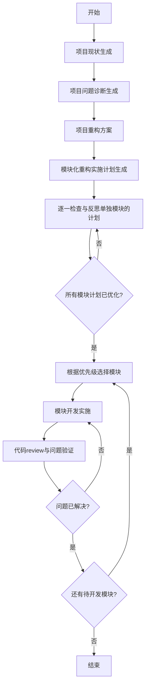

# 历史项目重构 Skill

## 概述

这个Skill旨在帮助用户对历史项目进行系统化的重构，通过多个阶段的分析、诊断和规划，最终实现高质量的代码重构。整个流程包括项目现状分析、问题诊断、重构方案设计、实施计划制定、计划反思以及逐模块开发实施。

## 输入

用户需要提供:
- 项目代码库访问权限
- 项目相关文档(README.md、架构图、设计文档等)
- 重构需求和目标

## 输出物结构
```
/docs
  /项目现状
    项目宏观概览报告.md
  /问题诊断
    项目问题诊断报告.md
  /重构方案
    {模块名}-重构方案文档.md
    ...
  /实施计划
    {模块名}-重构实施计划.md
    ...
  /优化后实施计划
    {模块名}-优化后实施计划.md
    ...
  /模块开发
    {模块名}-开发完成报告.md
    ...
```

## 输出

- 项目宏观概览报告
- 项目问题诊断报告
- 模块重构方案文档
- 模块重构实施计划
- 优化后的模块重构实施计划
- 重构后的代码实现


## 工作流程



## 阶段详情

### 1. 项目现状生成

**角色切换prompt**: @.历史项目重构skill/prompts/phase1_project_overview.md
**输入**: 整体项目自由探索分析  
**输出**: 项目宏观概览报告.md  
**描述**: 客观记录项目当前状态，不包含任何评价或问题判断。

### 2. 项目问题诊断生成

**角色切换prompt**: @.历史项目重构skill/prompts/phase2_problem_diagnosis.md
**输入**: 整体项目自由探索分析, 项目宏观概览报告.md  
**输出**: 单独的重构计划文件夹，包含多个问题诊断报告  
**描述**: 识别阻碍项目长期演进的系统性问题，聚焦架构、可维护性、性能、契约安全等高阶维度。

### 3. 项目重构方案

**角色切换prompt**: @.历史项目重构skill/prompts/phase3_refactoring_plan.md
**输入**: 项目宏观概览报告.md, 项目级问题诊断报告.md  
**输出**: 单独的重构计划文件夹，包含多个模块重构方案文档  
**描述**: 针对诊断出的问题，提出具体、可编码、兼容安全的改造方案。

### 4. 模块化重构实施计划生成

**角色切换prompt**: @.历史项目重构skill/prompts/phase4_implementation_plan.md
**输入**: 项目宏观概览报告.md, 项目级问题诊断报告.md，重构方案文档.md  
**输出**: 单独的重构计划文件夹，包含多个模块重构实施计划  
**描述**: 将重构方案按模块拆解为分阶段实施计划，每个阶段聚焦一个模块。

### 5. 逐一检查与反思单独模块的计划

**角色切换prompt**: @.历史项目重构skill/prompts/phase5_plan_reflection.md
**输入**: 项目宏观概览报告.md, 项目级问题诊断报告.md  
**输出**: 修改优化后的模块重构实施计划  
**描述**: 反思当前计划是否遵循了重构方案文档中的计划，进行必要的调整和优化。

### 6. 根据优先级逐一开发需要重构的模块

**角色切换prompt**: @.历史项目重构skill/prompts/phase6_module_development.md
**输入**: 模块重构方案文档.md, 模块重构实施计划.md, 对应语言的开发claude rule  
**输出**: 重构后的代码实现  
**描述**: 依据计划具体开发，测试直到单元测试全部通过，然后进行代码review，审查当前实施方案是否解决了最初的问题。

## 使用方法

1. 提供项目代码库访问权限
2. 启动Skill，开始项目现状分析
3. 审阅每个阶段的输出，并提供必要的反馈
4. 确认重构计划后，开始逐模块实施
5. 验证重构结果是否解决了原有问题

## 注意事项

- 所有输出必须基于用户明确提供的信息，禁止猜测或虚构
- 每个阶段只产生核心交付物，避免内容重叠
- 所有文档使用纯Markdown语法
- 重构过程中严格遵循"代码重构 → 补充测试 → 验证通过"流程