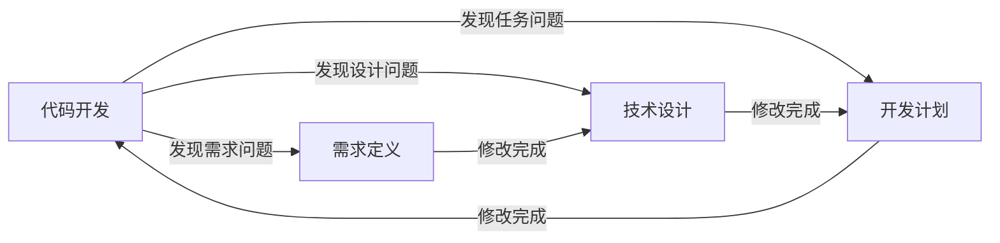

# AI驱动二开工作流 - 使用指南

## 快速开始

### 前置条件

1. 项目根目录下有 `.workflow/` 目录
2. 提示词模板位于 `.workflow/templates/`
3. 每个需求有独立的工作空间

### 工作流程概览

```
用户输入需求
    ↓
[核心协调Agent] 判断：新需求 or 继续需求？
    ↓
创建需求工作空间 .workflow/requirements/REQ_XXX/
    ↓
阶段0：项目探测 → project_snapshot.md
    ↓
阶段1：需求定义 → prd.md (可能需要澄清)
    ↓
阶段2：技术设计 → tech_design.md (可能需要澄清)
    ↓
阶段3：开发计划 → todo_list.md
    ↓
阶段4：代码开发 → 逐个任务完成
    ↓
需求完成 → 归档
```

---

## 提示词文件清单

| 文件名 | 作用 | 调用时机 |
|--------|------|----------|
| `_COORDINATOR_.prompt.md` | 核心协调Agent | 每次用户交互时调用 |
| `_STAGE0_DETECT_.prompt.md` | 项目探测 | 创建新需求后首先调用 |
| `_STAGE1_REQUIRE_.prompt.md` | 需求定义 | 项目探测完成后调用 |
| `_STAGE2_DESIGN_.prompt.md` | 技术设计 | PRD确认后调用 |
| `_STAGE3_PLAN_.prompt.md` | 开发计划 | 技术方案确认后调用 |
| `_STAGE4_EXECUTE_.prompt.md` | 代码开发 | 逐个任务调用 |

---

## 状态管理

### 全局项目状态

```yaml
# .workflow/project_state.yaml
project:
  name: "项目名称"
  root_path: "/path/to/project"
  created_at: "2024-01-01T00:00:00Z"

requirements:
  - id: "REQ_001_user_auth"
    name: "用户权限管理"
    status: "completed"
    created_at: "2024-01-01T00:00:00Z"
    artifacts_path: ".workflow/requirements/REQ_001_user_auth"
  - id: "REQ_002_data_export"
    name: "数据导出功能"
    status: "in_progress"
    created_at: "2024-01-02T00:00:00Z"
    artifacts_path: ".workflow/requirements/REQ_002_data_export"

current_requirement_id: "REQ_002_data_export"
```

### 单需求状态

```yaml
# .workflow/requirements/REQ_XXX/requirement_state.yaml
requirement:
  id: "REQ_001_user_auth"
  name: "用户权限管理"
  description: "实现基于角色的用户权限管理功能"
  created_at: "2024-01-01T00:00:00Z"
  status: "developing"

workflow:
  current_stage: "STAGE_EXECUTE"
  completed_stages:
    - "STAGE_DETECT"
    - "STAGE_REQUIRE"
    - "STAGE_DESIGN"
    - "STAGE_PLAN"
  stage_history:
    - stage: "STAGE_DETECT"
      timestamp: "2024-01-01T00:00:00Z"
      input: "用户需求描述"
      output: ".workflow/requirements/REQ_001_user_auth/stage0_detect/project_snapshot.md"
      status: "completed"
    # ... 其他阶段记录

artifacts:
  project_snapshot: "stage0_detect/project_snapshot.md"
  prd: "stage1_require/prd.md"
  tech_design: "stage2_design/tech_design.md"
  todo_list: "stage3_plan/todo_list.md"

pending_clarifications: []
```

---

## 澄清交互流程

### 触发条件

当产出物中包含 `{{CLARIFY}}` 标记时触发澄清交互。

### 澄清问题格式

```markdown
{{CLARIFY}}
### 问题1：{问题描述}

**背景**：{为什么需要澄清这个问题}

**选项**：
- A) 选项A的描述
- B) 选项B的描述
- C) 选项C的描述

请回复：1A 或 1B 或 1C
{{END_CLARIFY}}
```

### 用户回答格式

```
1A 2B 3C
```

### Agent处理流程

1. 解析用户回答
2. 更新相关产出物
3. 检查是否还有未解决的问题
   - 有：继续澄清
   - 无：进入下一阶段

---

## 确认交互流程

### 触发条件

当阶段产出物需要用户最终确认时，包含 `{{CONFIRM}}` 标记。

### 确认提示格式

```markdown
{{CONFIRM}}

请确认以上{文档类型}是否准确：
- 回复 "确认" 或 "confirm" 进入下一阶段
- 回复 "修改" 或 "edit" 并说明需要修改的内容
```

### 用户回答

```
确认
```

或

```
修改
请把 xxx 改为 yyy
```

---

## 回溯机制

### 什么时候回溯？

在阶段4（代码开发）执行过程中：

| 发现的问题 | 回溯到 | 原因 |
|------------|--------|------|
| 需求描述不清或不完整 | STAGE_1 | PRD需要补充或修改 |
| 技术方案设计缺陷 | STAGE_2 | 技术方案需要调整 |
| 任务拆分不合理 | STAGE_3 | 任务清单需要更新 |

### 回溯流程



---

## 多需求管理

### 创建新需求

```bash
# 用户输入新需求
用户: 我需要添加xxx功能

# 系统自动
1. 生成需求ID: REQ_003_xxx
2. 创建工作空间
3. 初始化需求状态
4. 设置为当前需求
5. 进入阶段0
```

### 切换需求

```bash
# 用户输入
用户: 切换到 REQ_002

# 系统处理
1. 检查需求是否存在
2. 加载需求状态
3. 从当前阶段继续
```

### 查看需求列表

```bash
# 用户输入
用户: 查看所有需求

# 系统输出
| 需求ID | 名称 | 状态 | 创建时间 |
|--------|------|------|----------|
| REQ_001 | 用户权限管理 | completed | 2024-01-01 |
| REQ_002 | 数据导出功能 | in_progress | 2024-01-02 |
| REQ_003 | xxx功能 | drafting | 2024-01-03 |
```

---

## 目录结构示例

```
项目根目录/
├── .workflow/
│   ├── project_state.yaml                    # 全局项目状态
│   ├── requirements/                         # 所有需求的工作空间
│   │   ├── REQ_001_user_auth/                # 已完成的需求
│   │   │   ├── requirement_state.yaml
│   │   │   ├── stage0_detect/
│   │   │   │   └── project_snapshot.md
│   │   │   ├── stage1_require/
│   │   │   │   └── prd.md
│   │   │   ├── stage2_design/
│   │   │   │   └── tech_design.md
│   │   │   ├── stage3_plan/
│   │   │   │   └── todo_list.md
│   │   │   └── stage4_execute/
│   │   │       ├── changes/
│   │   │       │   ├── task001.md
│   │   │       │   └── task002.md
│   │   │       └── summary.md
│   │   ├── REQ_002_data_export/              # 进行中的需求
│   │   │   ├── requirement_state.yaml
│   │   │   ├── stage0_detect/
│   │   │   │   └── project_snapshot.md
│   │   │   ├── stage1_require/
│   │   │   │   └── prd.md
│   │   │   └── stage2_design/
│   │   │       └── tech_design.md
│   │   └── REQ_003_xxx/                      # 新创建的需求
│   │       └── ...
│   └── templates/                            # 提示词模板
│       ├── _COORDINATOR_.prompt.md
│       ├── _STAGE0_DETECT_.prompt.md
│       ├── _STAGE1_REQUIRE_.prompt.md
│       ├── _STAGE2_DESIGN_.prompt.md
│       ├── _STAGE3_PLAN_.prompt.md
│       └── _STAGE4_EXECUTE_.prompt.md
├── backend/                                  # 项目后端代码
├── frontend/                                 # 项目前端代码
└── ...
```

---

## 完整示例

### 用户：我需要添加用户权限管理功能

#### 阶段0：项目探测

```
[Agent] 正在探测项目结构...

生成文件：.workflow/requirements/REQ_003_user_auth/stage0_detect/project_snapshot.md

项目探测完成。现在进入需求定义阶段。
```

#### 阶段1：需求定义

```
[Agent] 正在生成PRD...

生成文件：.workflow/requirements/REQ_003_user_auth/stage1_require/prd.md

{{CLARIFY}}
### 问题1：用户权限模型的实现方式是什么？

**背景**：您提到需要"用户权限管理"，但未说明具体的权限模型。

**选项**：
- A) 基于角色的访问控制（RBAC）：用户拥有角色，角色拥有权限
- B) 基于资源的访问控制（ABAC）：根据用户属性和资源属性动态判断
- C) 简单权限：用户直接拥有权限，无角色概念

请回复：1A 或 1B 或 1C
{{END_CLARIFY}}
```

```
[用户] 1A
```

```
[Agent] 已更新PRD，采用RBAC权限模型。

{{CONFIRM}}

请确认以上PRD是否准确：
- 回复 "确认" 或 "confirm" 进入技术设计阶段
- 回复 "修改" 或 "edit" 并说明需要修改的内容
```

```
[用户] 确认
```

#### 阶段2：技术设计

```
[Agent] 正在生成技术方案...

生成文件：.workflow/requirements/REQ_003_user_auth/stage2_design/tech_design.md

{{CONFIRM}}

请确认以上技术方案是否可行：
- 回复 "确认" 或 "confirm" 进入开发计划阶段
- 回复 "修改" 或 "edit" 并说明需要调整的内容
```

```
[用户] 确认
```

#### 阶段3：开发计划

```
[Agent] 正在生成开发任务清单...

生成文件：.workflow/requirements/REQ_003_user_auth/stage3_plan/todo_list.md

共拆解15个任务，预计工期5天。

现在开始执行任务1...
```

#### 阶段4：代码开发

```
[Agent] 执行任务1：创建数据模型

创建文件：backend/models/role.py
创建文件：backend/models/permission.py
创建文件：backend/models/user_role.py

任务1完成。

下一个任务：编写数据库迁移脚本
```

```
...（逐个完成任务）
```

```
[Agent] 所有任务已完成！

需求ID：REQ_003_user_auth
需求名称：用户权限管理功能
完成时间：2024-01-05T10:00:00Z

代码变更文件：
- backend/models/role.py (新增)
- backend/models/permission.py (新增)
- backend/models/user_role.py (新增)
- backend/api/roles.py (新增)
- backend/api/permissions.py (新增)
- backend/services/auth_service.py (修改)
- frontend/pages/Roles.tsx (新增)
- frontend/pages/Permissions.tsx (新增)

需求已完成并归档到：.workflow/requirements/REQ_003_user_auth/

您可以继续输入新需求。
```

---

## 常见问题

### Q1: 如何中途停止开发？

```
用户: 暂停
[Agent] 开发已暂停。当前进度已保存。
您可以随时回复"继续"来恢复开发。
```

### Q2: 如何查看当前进度？

```
用户: 查看进度
[Agent] 当前进度：
需求：REQ_003_user_auth
阶段：STAGE_EXECUTE
已完成：8 / 15 任务
下一步：任务9 - 创建权限API
```

### Q3: 如何放弃当前需求？

```
用户: 放弃当前需求
[Agent] 确认要放弃需求 "REQ_003_user_auth" 吗？
所有已完成的工作将保留在归档中，但状态将标记为 cancelled。

回复 "确认放弃" 或 "继续开发"
```

---

## 技巧与最佳实践

1. **需求描述要清晰**：越清晰的需求，澄清次数越少
2. **及时确认**：每个阶段确认后及时回复"确认"
3. **分批开发**：大型功能可拆分成多个小需求
4. **保留历史**：已完成的需求是宝贵的参考
5. **定期归档**：定期清理已完成的需求文件

---

## 版本历史

- v1.0 (2024-01-01): 初始版本
  - 统一的角色体系
  - 需求隔离机制
  - 澄清/确认交互
  - 回溯支持
