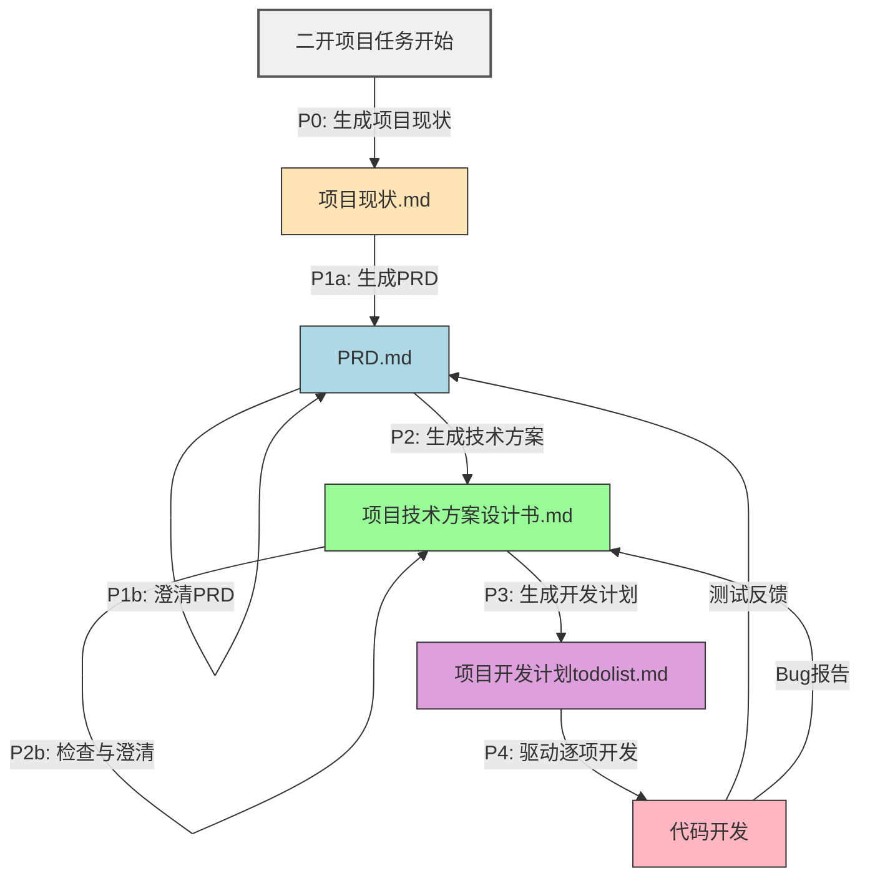

---

### 🔍 逻辑验证（关键！）

| 当前节点 | 使用的 Prompt | 动作 | 生成/进入下一节点 |
|--------|--------------|------|------------------|
| 二开项目任务开始 | **P0** | 生成项目背景 | → `项目现状.md` |
| `项目现状.md` | **P1a** | 生成产品需求 | → `PRD.md` |
| `PRD.md` | **P1b** | 澄清模糊点 | ↺ 自身（可多次） |
| `PRD.md` | **P2** | 生成技术方案 | → `项目技术方案设计书.md` |
| `项目技术方案设计书.md` | **P2b** | 检查澄清 | ↺ 自身 |
| `项目技术方案设计书.md` | **P3** | 拆解任务 | → `项目开发计划todolist.md` |
| `项目开发计划todolist.md` | **P4** | 驱动开发执行 | → `代码开发` |
